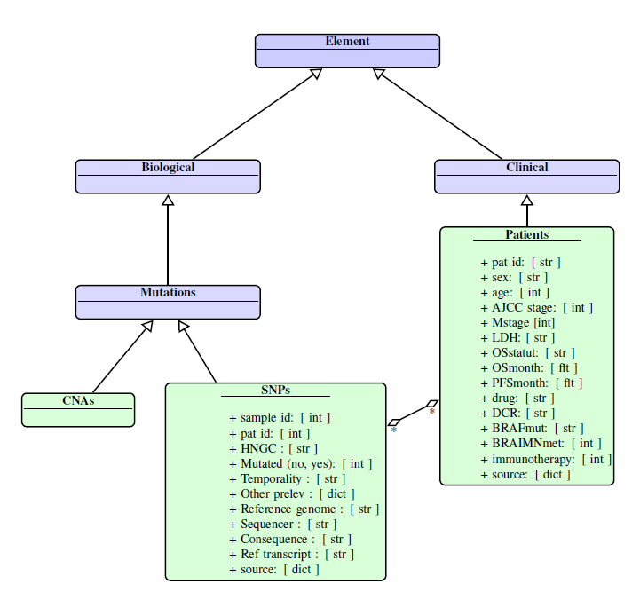

# Melano

This tool is the wore library to manage MelanoModel knowledge databases. <br />

The purpose of melano-py is to collect clinical data from clinical informations and to create a reference database. <br />

This module has been implemented in python 3.9

### Class diagram


### Dependencies:

```peewee``` version 3.13.3 <br />
```starlette``` version 0.13.4 <br />
```numpy``` <br />
```ujson``` <br />

### Installation

#### Mac and Linux
Create a virtual environment in melano-py root and load required package:
```bash env.sh```

#### Windows

Create a virtual environment in melano-py root:
```python -m virtualenv .venv```

Activate the virtual environment:
```.\.venv\Scripts\activate```

Install required packages:
```pip -m install -r requirements.txt```
